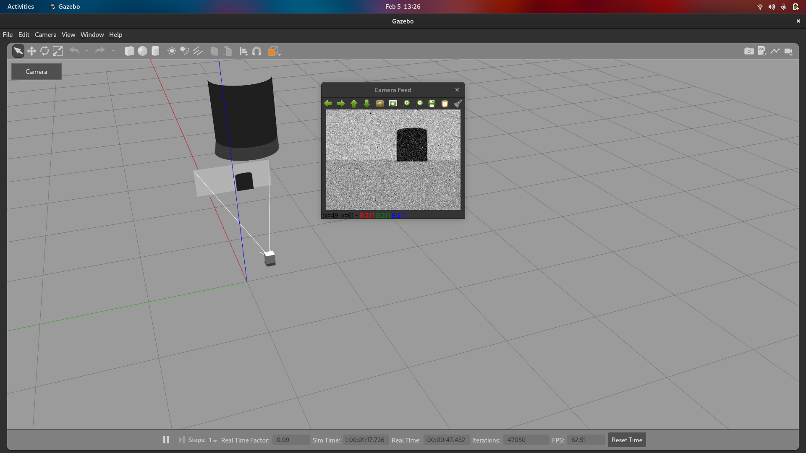

# CameraGuiPlugin
A simple camera button implementation to make my life easier while working with Gazebo

---
### TODO

- Fix Movement Lock for Camera
- Make a dropdown to select multiple cameras
- Add some safety locks for threading and exceptions

---
